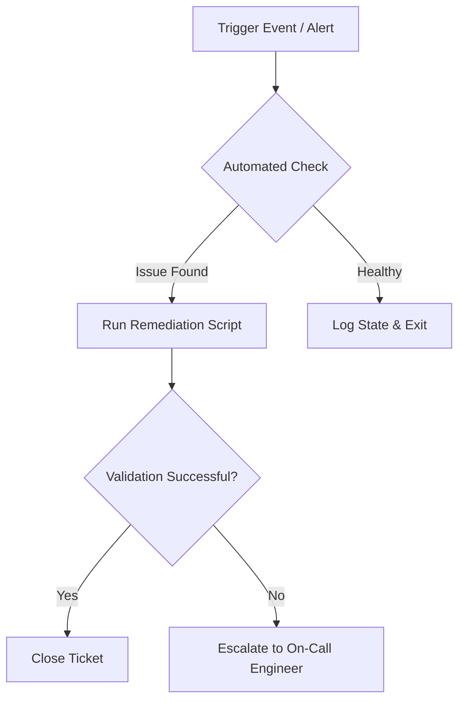
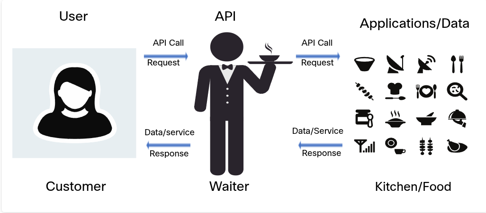

# Network

## 1. Introduction To IP address

IP addressing is used to identify devices on a network.

--- 

## 2. IPv4 Address 
### IPv4 is the ip that use to assign for device.
#### Example : PC, Printer, Server....!

IPv4 uses a 32-bit address.

Example:

`192.168.1.10`

---

## 3. IPv4 Structure

An IPv4 address contains four octets.

Example:

`192.168.1.10`

| Octet | Value |
|---|---:|
| 1 | 192 |
| 2 | 168 |
| 3 | 1 |
| 4 | 10 |

---

## 4. Subnet Mask

A subnet mask determines which part of the IP address represents the network and which part represents the host.

Example:

```text
IP Address:  192.168.1.10
Subnet Mask: 255.255.255.0
Prefix:      /24
```
## 5. IPv6 Address 
Ipv6 Is use 64bits and it have alot of number to asign more than IPv4 it also have number ad include charatic

Example:

```TExt
IPv6: 0010fde:f01e01/64
```
---
## Image Reference


---

## 6. Cloud Service
Cloud services provide on-demand access to computing resources—like servers, storage, databases, networking, and software—over the internet on a pay-as-you-go basis, replacing the need to buy and maintain physical hardware.
> Core Service Model:
---
Infrastructure as a Service (IaaS): Rent basic computing building blocks like virtual machines, storage, and networking (e.g., AWS EC2, Google Compute Engine).

Platform as a Service (PaaS): Access a pre-configured environment to build, deploy, and manage applications without worrying about managing servers or operating systems (e.g., Heroku, Google App Engine).

Software as a Service (SaaS): Use fully hosted, ready-to-use applications through a web browser (e.g., Google Workspace, Microsoft 365, Salesforce).

---
## Example:


---
## 7. Network Automation
Network automation is the process of using software, scripts, and programmable workflows to automate the provisioning, configuration, management, testing, and operation of network devices (like routers, switches, firewalls, and load balancers).

Instead of engineers manually logging into every device via Command Line Interface (CLI) to make changes, software tools execute tasks consistently across hundreds or thousands of devices at once.

### key Component:
```Text:
API & Controller-Driven (SDN): Software-Defined Networking (SDN) centralizes control using APIs (REST, NETCONF/RESTCONF) to push configuration changes and query network telemetry in real time.

Infrastructure as Code (IaC): Network configurations are written as code (often in YAML or JSON) and stored in version control systems (like Git), allowing changes to be reviewed, tested, and tracked before deployment.

Orchestration & Workflow Tools: Central platforms manage complex sequential workflows, such as updating security rules across firewalls, load balancers, and switches simultaneously.
```
### Common tool 
```Text:
-- Configuration Management: Ansible, Terraform, Puppet, Chef

-- Programming & Libraries: Python (Netmiko, Nornir, NAPALM), Scapy

-- Network Fabrics & Platforms: Cisco ACI, VMware NSX, Juniper Apstra
```
## 📊 Mermaid Diagrams
Create powerful visualizations directly in markdown:


---

## 8. The API Concept 
API are found almost everywhere. Amazon Web service, Facebook,and home automation.
An API is allow other application to access its data or service. It is set rules to Describe other application can interact with another.

--- 


---
#### API Example:
---


---
## 9. REST
REST (Representational State Transfer) is an architectural style designed for network-based applications, most commonly used to build web APIs that allow client applications to communicate with a server.
#### Rest Archtitechture
```Text
- Client-Server Architecture: Separates user interface concerns (client) from data storage concerns (server), allowing each to evolve independently.

- Statelessness: Every request from a client must contain all the information necessary to understand and process it. The server stores no client session context between requests.

- Cacheability: Responses must explicitly define whether they can be cached to prevent clients from reusing stale data.
```


---
### URI Identify


# Main Components

API Server ([http://www.mapquestapi.com/](http://www.mapquestapi.com/)): The domain and protocol pointing to the server hosting the web service.

## Resources (directions/v2/route): 
The specific path on the server that defines what action to perform—in this case, calculating a driving route using version 2 of MapQuest's directions service.

## Query(outFormat=json&key=KEY&from=San+Jose,Ca&to=Monterey,Ca): 
The section following the ? character that passes extra key-value parameters to refine the request.

# Query Parameters

## Format (outFormat=json): 
Tells the API to return the response formatted as a JSON object.

## Key (key=KEY): 
Your unique API authentication key, allowing the server to authorize the request.

## Parameters (from=San+Jose,Ca&to=Monterey,Ca): 
The input values for the route calculation, specifying the starting location (San Jose, CA) and destination (Monterey, CA).

# 10. Automation Script Network 
---
### How they work:
Define the Source of Truth:

Instead of checking a spreadsheet, the engineer maintains network state data (IP addresses, VLAN IDs, hostnames) in a database tool like NetBox or Git repositories.

Write Templates and Automation Code:

Ansible: The engineer writes a YAML file called a playbook defining the desired outcome (e.g., "Ensure VLAN 20 exists on all switches").

Python: For custom logic or data processing, the engineer writes scripts using specialized network libraries:

Netmiko or Paramiko to open SSH connections to hardware.

Jinja2 to generate device configuration files from templates.

TextFSM or  Genie to translate unstructured raw CLI outputs into structured JSON.

Test in a Staging Lab:

Before pushing changes to production, the engineer executes the script against simulated environments (e.g., GNS3, Containerlab, or Cisco Modeling Labs).

Execute via API or Automation Pipeline:

The engineer runs the playbook or pushes the code to a CI/CD pipeline (like GitHub Actions or GitLab CI). The system logs into hundreds of devices simultaneously via APIs (RESTCONF/NETCONF) or SSH to make the updates.

Verify and Audit State:

The code checks device responses to confirm the network state matches expectations, automatically logging changes into ticket systems like Jira or ServiceNow.

---
```Text:
Example of how it work:
What if we want to Push new Vlan to All switch in the Network that have the same user name and password.
```
## Script Code Example:
Before we config this scrip we must to config IP, Username, Password, SSH by Console first.
### Code example of every switch:
```Python
from netmiko import ConnectHandler

# 1. Define a list of all your switch IP addresses
switch_ips = [
    '192.168.1.50',
    '192.168.1.51',
    '192.168.1.52',
    '192.168.1.53'
]

# 2. Commands to push to every switch
vlan_commands = [
    'vlan 20',
    'name GUEST_WIFI',
    'state active'
]

# 3. Loop through each switch automatically
for ip in switch_ips:
    print(f"\n--- Connecting to Switch at {ip} ---")
    
    device = {
        'device_type': 'cisco_ios',
        'host': ip,
        'username': 'admin',
        'password': 'Cisco123',
    }
    
    try:
        net_connect = ConnectHandler(**device)
        output = net_connect.send_config_set(vlan_commands)
        net_connect.save_config()
        print(f"Successfully configured VLAN 20 on {ip}")
        net_connect.disconnect()
        
    except Exception as e:
        print(f"Failed to configure {ip}: {e}")
```
---
## Out-Put of this Script
```
--- Connecting to Switch at 192.168.1.50 ---
Successfully configured VLAN 20 on 192.168.1.50

--- Connecting to Switch at 192.168.1.51 ---
Successfully configured VLAN 20 on 192.168.1.51

--- Connecting to Switch at 192.168.1.52 ---
Failed to configure 192.168.1.52: Authentication to device failed.

--- Connecting to Switch at 192.168.1.53 ---
Successfully configured VLAN 20 on 192.168.1.53
```
---
# 11. Feature Availability by Device Type

| Security Feature | Switches | Routers | Firewalls |
| :--- | :---: | :---: | :---: |
| **ACLs (IP/Subnet Blocking)** | ✅ Supported | ✅ Supported | ✅ Supported (via Policies) |
| **Interface Descriptions / IP Assignment** | ✅ Supported | ✅ Supported | ✅ Supported |
| **VLAN Creation** | ✅ Supported | ❌ Limited (Uses Sub-interfaces) | ❌ Limited (Uses Sub-interfaces) |
| **Port Security (MAC address locks)** | ✅ Supported | ❌ Not Supported | ❌ Not Supported |

# 11. ACL rule
### What is ACL and how it work ?
ACL is the short name of Access control list and ACL is work as one of the security that provice network eng to config of kind: 
block port , act like firewall but can not block website.
```Bash 
Create an extended ACL named BLOCK_WEB
ip access-list extended BLOCK_WEB
deny tcp any host 10.0.0.50 eq 80
permit ip any any

Apply the ACL to the incoming interface
interface GigabitEthernet0/0
ip access-group BLOCK_WEB in
```
# 12. NAT (Network Address translation)
NAT (Network Address Translation) is a networking method that remaps IP address spaces by modifying network address information in the IP header of packets while they are in transit across a routing device.

Think of NAT like a mailroom in an apartment building: all residents (devices on your local network) have their own apartment numbers (private IP addresses), but external mail sent to the outside world leaves with the building's single street address (public IP address). When responses return to the building, the mailroom routes them back to the correct apartment based on tracked request numbers.

---

| Type | Description | Primary Use Case |
| :--- | :--- | :--- |
| **Static NAT** | Maps a single private IP address to a single public IP address permanently on a 1:1 basis. | Hosting web or email servers on internal networks that need consistent public exposure. |
| **Dynamic NAT** | Maps an unallocated private IP address to a public IP address selected from a pool of public IPs. | Networks with multiple public IP allocations where devices connect periodically. |
| **PAT (Port Address Translation)** | *Also known as NAT Overload.* Maps multiple private IP addresses to a single public IP by appending unique source port numbers to track connections. | Standard home networks, small offices, and consumer Wi-Fi routers. |

---
### Example
Network Topology Assumptions
Inside Interface (LAN): GigabitEthernet0/0 (Network: 192.168.1.0/24)

Outside Interface (WAN): GigabitEthernet0/1 (Public IP: 203.0.113.1/30)

```bash
! Step 1: Define Inside and Outside interfaces
interface GigabitEthernet0/0
 ip address 192.168.1.1 255.255.255.0
 ip nat inside
 exit

interface GigabitEthernet0/1
 ip address 203.0.113.1 255.255.255.252
 ip nat outside
 exit

! Step 2: Define an Access List (ACL) matching internal traffic
ip access-list standard LAN_SUBNET
 permit 192.168.1.0 0.0.0.255
 exit

! Step 3: Enable NAT Overload (PAT) on the outside interface
ip nat inside source list LAN_SUBNET interface GigabitEthernet0/1 overload
```
---

